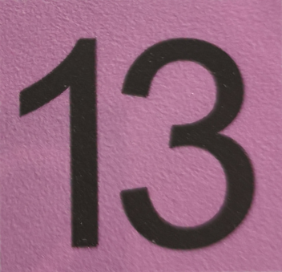
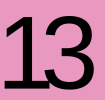

# Shanghai Metro Line ID Block Generator

[](https://www.npmjs.com/package/@kyuri-metro/shmetro-line-id-block-generator) [](https://opensource.org/licenses/MIT)

*[中文文档](README.zh-CN.md)*

A tool to generate Shanghai Metro-style (currently over-the-door route map style) line number block SVG graphics. It provides both an intuitive Web interface (online webpage) and an **npm module** that can be used as a dependency in Node.js and browser environments.

**🔗 Web Online Version:** https://unnamed2964.github.io/kyuri-shmetro-line-id-block-generator/

## Preview

All line number block (Line 1-23) generated by this library.


## Validation Against Real Signage

| Real Signage                                                 | Generated                        |
| ------------------------------------------------------------ | -------------------------------- |
|  |    |
|  |    |
|  |  |
|  |  |
|  |  |
|  |  |
|  |  |

## Disclaimer

The design parameters (positioning, font size, etc.) of this tool are based on a **rough visual reverse-engineering** of real-life photos in the `reference/` directory. They are personal estimations and **do not represent any official corporate visual standards or official specifications of the Shanghai Shentong Metro Group Co., Ltd.**

The output results are solely for personal study, reference, and non-commercial purposes. Please do not use them for any official or commercial occasions.

## References 

The `reference/` directory contains real-life photos used as references for reverse engineering, serving only as the basis for deriving design parameters.

## Reverse Engineering Notes

The layout parameters of the line number blocks were derived through visual reverse engineering based on real-world photos.

Photos were captured as front-facing as possible (using a selfie stick) to reduce perspective distortion. The block proportions were assumed to match the line number blocks appearing in the official Shanghai Metro route map SVG published on the Shanghai Metro website.

Based on this assumption, text positioning and scaling were visually fitted to match real signage.

General fitting rules observed:

- Most line numbers share the same `<text>` coordinates and spacing parameters.
- Narrow-number cases require special adjustments:
  - `1`, `11`, `21` require modified positioning due to their visual width.
- Two-digit lines starting with `2` (`2x`) require horizontal compression to match the appearance of real signage.

Reference photos used for fitting are stored in the `reference/` directory.

## Features

- Support inputting line numbers in the webpage to preview the line number block effect in real-time.
- Out-of-the-box support for the standard colors of Shanghai Metro lines 1-23, with matching standard black or white text colors.
- Export standard SVGs (including the `<text>` element).
- Export vector path SVGs (converts text to vector paths via `opentype.js`, eliminating system font dependency limits).
- Published as an NPM package, allowing you to generate pure SVG strings or embed into existing SVGs within any Node.js/TypeScript or Web project.

## Using as an NPM Package

You can install the core generation logic as an independent dependency in your frontend or backend projects.

### Installation

```bash
npm install @kyuri-metro/shmetro-line-id-block-generator
```

### Code Example (Node.js/TypeScript Environment)

It supports outputting a complete independent SVG document with a `viewBox` canvas. It also supports skipping the wrapper container by passing `wrapper: false`, which generates only the internal graphic `<g>...</g>` to embed inside other large SVGs.

```typescript
import { generateSVG } from '@kyuri-metro/shmetro-line-id-block-generator';

// 1. Generate a complete standalone SVG string image (e.g. Line 2)
const svgString = generateSVG(2);
// Or configuration passing
const svgString2 = generateSVG({ lineNumber: '9' });

// 2. For stitching SVG graphics: only get the '<g>...</g>' content for embedding, without the top-level wrapper
const embeddableGroup = generateSVG({ 
    lineNumber: '11', 
    wrapper: false 
});
console.log(embeddableGroup);
```

### Direct Import in Browser Environments (UMD Support)

Via a CDN or your locally bundled `dist/bundle.js` file, this library registers a global variable `window.ShmetroGenerator` to be used directly in pure HTML pages:

```html
<script src="https://unpkg.com/@kyuri-metro/shmetro-line-id-block-generator/dist/bundle.js"></script>
<script>
    // Native calling
    const svgCode = window.ShmetroGenerator.generateSVG(10);
    document.getElementById("container").innerHTML = svgCode;
</script>
```

## Running the Webpage Locally

Just open `shmetro-line-id-block-generator.html` of the project in your browser (Ensure you have built the core distributions with `npm run build` beforehand).

## License

[MIT License](LICENSE)

## Author

Made by [Umamichi](https://github.com/Unnamed2964)


