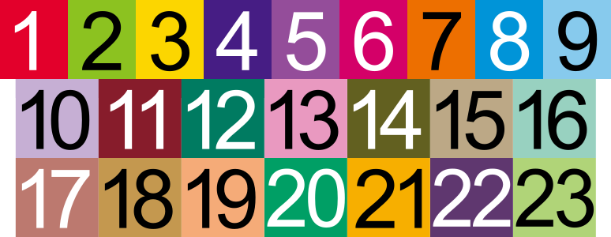
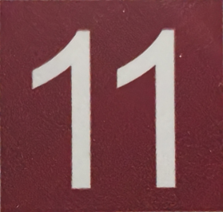
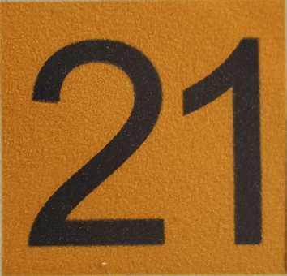
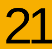
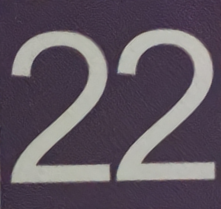

# 上海地铁线路号方块生成器

[](https://www.npmjs.com/package/@kyuri-metro/shmetro-line-id-block-generator) [](https://opensource.org/licenses/MIT)

*[English Documentation](README.md)*

一个用于生成上海地铁风格（暂时为通长风格）的线路号方块 SVG 图形的工具。它既提供了一个直观的 Web 界面（在线网页），也提供了一个可以在 Node.js 和浏览器中作为依赖使用的 **npm 模块**。

**🔗 在线 Web 版本：** https://unnamed2964.github.io/kyuri-shmetro-line-id-block-generator/

## 效果预览

本库生成的所有线路编号方块（1-23 号线）效果如下。



## 与真实标识对比验证

| 真实标识 | 生成效果 |
| ------------------------------------------------------------ | ---------------------------------------- |
|  |            |
|  |    |
|  |          |
|  |  |
|  |          |
|  |          |

## 免责声明

本工具的设计参数（定位、字号等）均来自对 `reference/` 目录中实拍照片的**粗略视觉逆向工程**，属于个人估算，**不代表上海申通地铁集团有限公司的任何企业视觉标准或官方规范**。

输出结果仅供个人学习、参考及非商业用途，请勿将其用于任何官方或商业场合。

## 参考素材

`reference/` 目录中存放了逆向工程所参照的实拍图片，仅作为设计参数推导依据。

## 逆向工程说明

本项目中的线路编号方块布局参数是通过对真实标识进行视觉逆向工程得到的，主要依据来自现实拍摄的照片。

拍摄时尽量使用接近正对的角度（通过自拍杆拍摄）以减少透视畸变。方块的整体比例假定与上海地铁官网发布的官方线路图 SVG 中的线路编号方块保持一致。

在此比例假设基础上，通过视觉拟合方式确定文字的位置与缩放参数，以尽量贴近真实标识效果。

在拟合过程中总结出以下一般规律：

- 大多数线路编号共用相同的 `<text>` 坐标与间距参数。
- 一些视觉宽度较窄的编号需要单独调整：
  - `1`、`11`、`21` 需要额外的定位修正。
- 以 `2` 开头的两位数线路（`2x`）需要进行一定的横向压缩，以更接近真实标识的视觉效果。

用于拟合的参考照片存放在 `reference/` 目录中。

## 功能

- 支持在网页中输入线路号码，实时预览线路号方块效果
- 开箱即用支持 1-23 号线的标准颜色和黑白文字色
- 导出标准 SVG（含 `<text>` 元素）
- 导出字形路径版 SVG（通过 opentype.js 将文字转为矢量路径，无系统字体依赖限制）
- 作为 NPM 包，支持在任意 Node.js/TypeScript 项目以及 Web 项目中引用生成纯字符串 SVG，或是用于无缝嵌入已有 SVG 中。

## 作为 NPM 包使用

你可以将核心生成逻辑作为独立的依赖安装到你的前端或后端项目中。

### 安装

```bash
npm install @kyuri-metro/shmetro-line-id-block-generator
```

### 代码示例 (Node.js/TypeScript 环境)

支持输出完整带有 `viewBox` 画布的独立 SVG 文档，也支持通过关闭 `wrapper`，仅生成内部图形组合 (`<g>...</g>`) 供其它大图表嵌入。

```typescript
import { generateSVG } from '@kyuri-metro/shmetro-line-id-block-generator';

// 1. 生成完整的独立 SVG 字符串图像（比如 2 号线）
const svgString = generateSVG(2);
// 或者配置传入
const svgString2 = generateSVG({ lineNumber: '9' });

// 2. 对于拼接 SVG 图形：仅获取用于内嵌的 '<g>...</g>' 内容，不带顶层包装
const embeddableGroup = generateSVG({ 
    lineNumber: '11', 
    wrapper: false 
});
console.log(embeddableGroup);
```

### 在浏览器环境直接引用 (UMD 支持)

通过 CDN 或者本地打包的 `dist/bundle.js` 文件，本库将其注册为全局变量 `window.ShmetroGenerator` 以便在纯 HTML 页面引用使用：

```html
<script src="https://unpkg.com/@kyuri-metro/shmetro-line-id-block-generator/dist/bundle.js"></script>
<script>
    // 原生调用
    const svgCode = window.ShmetroGenerator.generateSVG(10);
    document.getElementById("container").innerHTML = svgCode;
</script>
```

## 本地网页运行

直接在浏览器中打开项目的 `shmetro-line-id-block-generator.html` （运行前需确认已通过 `npm run build` 构建了核心分发产物）。

## 许可证

[MIT License](LICENSE)

## 作者

Made by [Umamichi](https://github.com/Unnamed2964)


